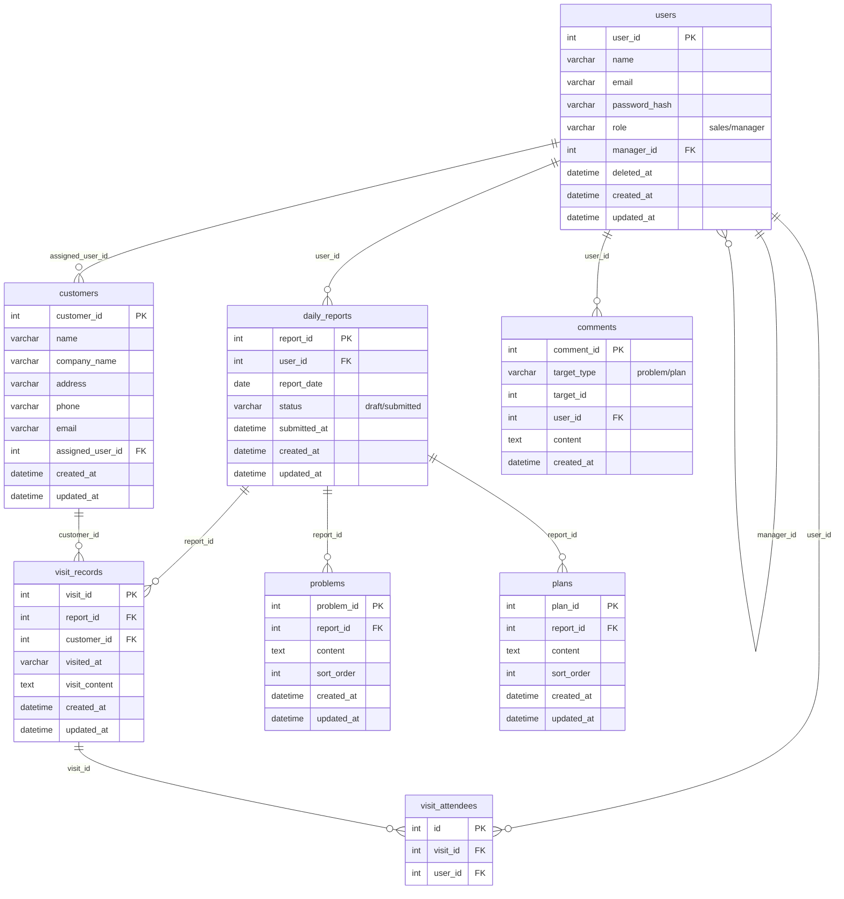

# ER図 - 営業日報システム

## テーブル概要

| テーブル | 説明 |
|---|---|
| `users` | 営業・上長を統合管理。`role` で区別、`manager_id` で自己参照（上長関係）。論理削除対応。 |
| `customers` | 顧客マスタ。担当営業を `assigned_user_id` で紐付け。 |
| `daily_reports` | 日報本体。1ユーザー×1日=1件。`status` で下書き/提出済みを管理。 |
| `visit_records` | 訪問記録。日報に複数件紐付き、顧客マスタへFK。 |
| `visit_attendees` | 訪問の同行者（中間テーブル）。`visit_id + user_id` の複合ユニーク。 |
| `problems` | 日報の課題項目。日報に複数件紐付き。 |
| `plans` | 日報の翌日計画項目。日報に複数件紐付き。 |
| `comments` | Problem/Plan へのコメント。`target_type + target_id` のポリモーフィック構造で1テーブルに統合。 |
