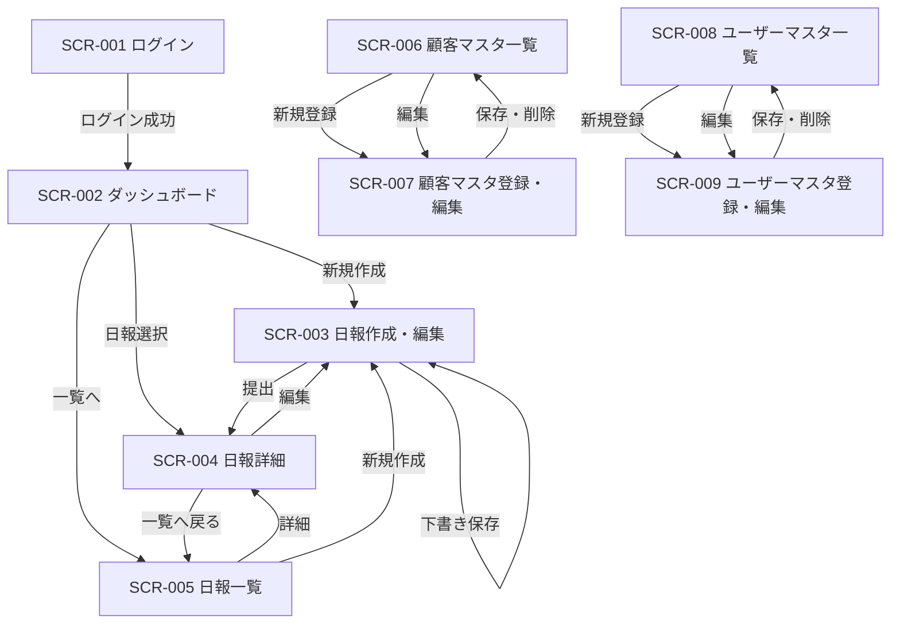

# 画面定義書 - 営業日報システム

## 画面一覧

| 画面ID | 画面名 | 対象ロール |
|---|---|---|
| SCR-001 | ログイン | 全員 |
| SCR-002 | ダッシュボード | 全員 |
| SCR-003 | 日報作成・編集 | 営業 |
| SCR-004 | 日報詳細 | 全員 |
| SCR-005 | 日報一覧 | 全員 |
| SCR-006 | 顧客マスタ一覧 | 全員 |
| SCR-007 | 顧客マスタ登録・編集 | 上長 |
| SCR-008 | ユーザーマスタ一覧 | 上長 |
| SCR-009 | ユーザーマスタ登録・編集 | 上長 |

---

## SCR-001 ログイン

### 概要
システムへのログイン画面。全ユーザー共通のエントリーポイント。

### 項目定義

| 項目名 | 種別 | 必須 | 備考 |
|---|---|---|---|
| メールアドレス | テキスト入力 | ○ | |
| パスワード | パスワード入力 | ○ | |
| ログインボタン | ボタン | - | |

### アクション

| アクション | 処理 | 遷移先 |
|---|---|---|
| ログインボタン押下 | 認証処理 | SCR-002 ダッシュボード |
| 認証失敗 | エラーメッセージ表示 | 同画面 |

---

## SCR-002 ダッシュボード

### 概要
ログイン後のトップ画面。営業は自分の直近日報、上長は部下の未確認日報を確認できる。

### 表示内容

#### 営業ロール
| 項目名 | 内容 |
|---|---|
| 今日の日報ステータス | 未作成 / 下書き / 提出済 |
| 直近5件の日報リスト | 日付・ステータス |
| 上長からの未読コメント数 | バッジ表示 |

#### 上長ロール
| 項目名 | 内容 |
|---|---|
| コメント未記入の提出済み日報数 | バッジ表示 |
| 部下の日報提出状況（当日） | 担当者名・ステータス一覧 |

### アクション

| アクション | 遷移先 |
|---|---|
| 「今日の日報を作成」ボタン | SCR-003 日報作成 |
| 日報リストの行クリック | SCR-004 日報詳細 |
| 「日報一覧へ」リンク | SCR-005 日報一覧 |

---

## SCR-003 日報作成・編集

### 概要
営業が日報を作成・編集する画面。下書き保存と提出が可能。

### 項目定義

#### ヘッダー情報
| 項目名 | 種別 | 必須 | 備考 |
|---|---|---|---|
| 日付 | 日付表示（固定） | ○ | 本日日付で自動セット |
| 担当者名 | テキスト表示（固定） | ○ | ログインユーザーで自動セット |

#### 訪問記録（複数行追加可）
| 項目名 | 種別 | 必須 | 備考 |
|---|---|---|---|
| 顧客名 | セレクトボックス | ○ | 顧客マスタから選択 |
| 訪問時刻 | 時刻入力 | - | HH:MM形式 |
| 訪問内容 | テキストエリア | ○ | |
| 同行者 | マルチセレクト | - | ユーザーマスタから選択 |
| 行追加ボタン | ボタン | - | 行を1件追加 |
| 行削除ボタン | ボタン | - | 対象行を削除 |

#### 課題・相談（Problem）（複数行追加可）
| 項目名 | 種別 | 必須 | 備考 |
|---|---|---|---|
| 内容 | テキストエリア | - | |
| 行追加ボタン | ボタン | - | 行を1件追加 |
| 行削除ボタン | ボタン | - | 対象行を削除 |

#### 明日の予定（Plan）（複数行追加可）
| 項目名 | 種別 | 必須 | 備考 |
|---|---|---|---|
| 内容 | テキストエリア | - | |
| 行追加ボタン | ボタン | - | 行を1件追加 |
| 行削除ボタン | ボタン | - | 対象行を削除 |

### アクション

| アクション | 処理 | 遷移先 |
|---|---|---|
| 「下書き保存」ボタン | status=draft で保存 | 同画面（保存完了メッセージ） |
| 「提出」ボタン | バリデーション後 status=submitted で保存 | SCR-004 日報詳細 |
| 「キャンセル」リンク | 変更を破棄 | SCR-002 ダッシュボード |

### バリデーション
- 訪問記録が1件以上あること
- 訪問記録の顧客名・訪問内容は必須

---

## SCR-004 日報詳細

### 概要
日報の内容を閲覧し、上長がProblem・Planにコメントを追加する画面。

### 表示内容

#### ヘッダー情報
| 項目名 | 内容 |
|---|---|
| 日付 | 日報の日付 |
| 担当者名 | 作成した営業担当者名 |
| ステータス | 下書き / 提出済 |
| 提出日時 | 提出済みの場合に表示 |

#### 訪問記録一覧
| 項目名 | 内容 |
|---|---|
| 顧客名 | |
| 訪問時刻 | |
| 訪問内容 | |
| 同行者 | カンマ区切りで表示 |

#### 課題・相談（Problem）
| 項目名 | 内容 |
|---|---|
| 内容 | |
| コメント一覧 | 上長名・コメント日時・コメント内容 |
| コメント入力欄 | 上長ロールのみ表示。テキストエリア＋送信ボタン |

#### 明日の予定（Plan）
| 項目名 | 内容 |
|---|---|
| 内容 | |
| コメント一覧 | 上長名・コメント日時・コメント内容 |
| コメント入力欄 | 上長ロールのみ表示。テキストエリア＋送信ボタン |

### アクション

| アクション | 対象ロール | 処理 | 遷移先 |
|---|---|---|---|
| 「編集」ボタン | 営業（下書きのみ） | - | SCR-003 日報編集 |
| コメント送信ボタン | 上長 | コメント保存 | 同画面（コメント追加） |
| 「一覧へ戻る」リンク | 全員 | - | SCR-005 日報一覧 |

---

## SCR-005 日報一覧

### 概要
日報を検索・一覧表示する画面。

### 検索条件

| 項目名 | 種別 | 備考 |
|---|---|---|
| 期間（From） | 日付入力 | デフォルト：当月初日 |
| 期間（To） | 日付入力 | デフォルト：本日 |
| 担当者 | セレクトボックス | 上長のみ表示。営業は自分固定 |
| ステータス | セレクトボックス | 全て / 下書き / 提出済 |
| 検索ボタン | ボタン | |

### 一覧表示項目

| 項目名 | 内容 |
|---|---|
| 日付 | |
| 担当者名 | |
| 訪問顧客数 | 当日の訪問記録件数 |
| ステータス | 下書き / 提出済 |
| コメント数 | Problem・Planへのコメント合計数 |
| 操作 | 「詳細」リンク |

### アクション

| アクション | 遷移先 |
|---|---|
| 「詳細」リンク | SCR-004 日報詳細 |
| 「新規作成」ボタン（営業のみ） | SCR-003 日報作成 |

---

## SCR-006 顧客マスタ一覧

### 概要
顧客マスタの検索・一覧表示画面。

### 検索条件

| 項目名 | 種別 | 備考 |
|---|---|---|
| 顧客名 | テキスト入力 | 部分一致 |
| 会社名 | テキスト入力 | 部分一致 |
| 担当営業 | セレクトボックス | |
| 検索ボタン | ボタン | |

### 一覧表示項目

| 項目名 | 内容 |
|---|---|
| 顧客名 | |
| 会社名 | |
| 電話番号 | |
| 担当営業 | |
| 操作 | 「詳細・編集」リンク（上長のみ） |

### アクション

| アクション | 対象ロール | 遷移先 |
|---|---|---|
| 「新規登録」ボタン | 上長 | SCR-007 顧客マスタ登録 |
| 「詳細・編集」リンク | 上長 | SCR-007 顧客マスタ編集 |

---

## SCR-007 顧客マスタ登録・編集

### 概要
顧客情報の登録・編集画面。上長のみ操作可能。

### 項目定義

| 項目名 | 種別 | 必須 | 備考 |
|---|---|---|---|
| 顧客名 | テキスト入力 | ○ | |
| 会社名 | テキスト入力 | ○ | |
| 住所 | テキスト入力 | - | |
| 電話番号 | テキスト入力 | - | |
| メールアドレス | テキスト入力 | - | |
| 担当営業 | セレクトボックス | - | ユーザーマスタ（営業ロール）から選択 |

### アクション

| アクション | 処理 | 遷移先 |
|---|---|---|
| 「保存」ボタン | バリデーション後に保存 | SCR-006 顧客マスタ一覧 |
| 「削除」ボタン（編集時のみ） | 確認ダイアログ後に削除 | SCR-006 顧客マスタ一覧 |
| 「キャンセル」リンク | 変更を破棄 | SCR-006 顧客マスタ一覧 |

---

## SCR-008 ユーザーマスタ一覧

### 概要
ユーザー（営業・上長）の一覧表示画面。上長のみアクセス可能。

### 一覧表示項目

| 項目名 | 内容 |
|---|---|
| 氏名 | |
| メールアドレス | |
| ロール | 営業 / 上長 |
| 上長名 | 担当上長の名前 |
| 操作 | 「編集」リンク |

### アクション

| アクション | 遷移先 |
|---|---|
| 「新規登録」ボタン | SCR-009 ユーザーマスタ登録 |
| 「編集」リンク | SCR-009 ユーザーマスタ編集 |

---

## SCR-009 ユーザーマスタ登録・編集

### 概要
ユーザー情報の登録・編集画面。上長のみ操作可能。

### 項目定義

| 項目名 | 種別 | 必須 | 備考 |
|---|---|---|---|
| 氏名 | テキスト入力 | ○ | |
| メールアドレス | テキスト入力 | ○ | ログインIDとして使用 |
| パスワード | パスワード入力 | ○（登録時） | 編集時は空欄で変更なし |
| ロール | ラジオボタン | ○ | 営業 / 上長 |
| 上長 | セレクトボックス | - | ロールが「営業」の場合のみ表示 |

### アクション

| アクション | 処理 | 遷移先 |
|---|---|---|
| 「保存」ボタン | バリデーション後に保存 | SCR-008 ユーザーマスタ一覧 |
| 「削除」ボタン（編集時のみ） | 確認ダイアログ後に論理削除 | SCR-008 ユーザーマスタ一覧 |
| 「キャンセル」リンク | 変更を破棄 | SCR-008 ユーザーマスタ一覧 |

---

## 画面遷移図

